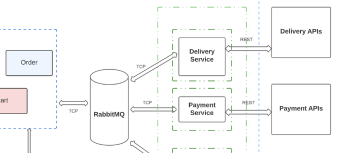
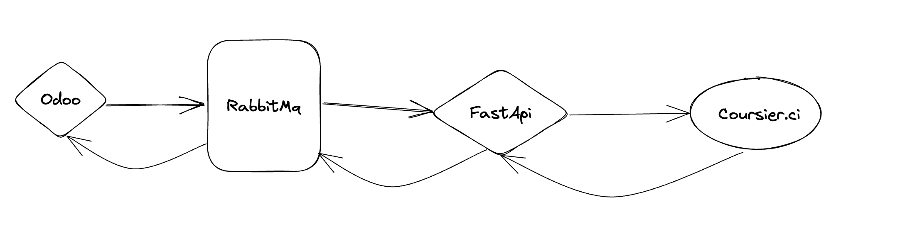

# Micro Service Goodee-Coursier.ci
Pour établir la communication entre le webservie odoo de Goodee et le service de livraison [Coursier.ci](./http://coursier.ci/), nous allons mettre en place un microservice.

- Pour résumer la situation, on a: 

## 1. Odoo

Le webservice odoo envoie un message vers RabbitMq puis reçoit une réponse qui lui permet de savoir que son message a bien été enregistré.
###  Request HTTPS: 
- Ordre:
description: Entité représentant un ordre d'enlèvement/livraison à effectuer par  
[Coursier.ci](./http://coursier.ci/)  
required:
- orderId  
- deliveryType  
type: object  
properties:  
orderId:  
description: Numéro d'identification de la demande interne au demandeur  
type: string  
example: AAA111-2022  
desiredPickUpDate:  
allOf:
- $ref: '#/components/schemas/LocalDate'  
- description: "Date d'enlèvement souhaité (optionnelle), si elle diffé\  
re des accords contractuels/type d'ordre"  
default: AAAA-MM-JJ  
pickupAddress:  
$ref: '#/components/schemas/Adresse'  
pickUpContact:  
$ref: '#/components/schemas/Contact'  
pickupTimeRange:  
$ref: '#/components/schemas/TimeRange'  
desiredDeliveryDate:  
allOf:     
- $ref: '#/components/schemas/LocalDate'  
- description: "Date de livraison souhaité (optionnelle), si elle diffé\  
re des accords contractuels/type d'ordre"  
default: AAAA-MM-JJ  
deliveryAddress:  
$ref: '#/components/schemas/Adresse'  
deliveryContact:  
$ref: '#/components/schemas/Contact'  
deliveryTimeRange:  
$ref: '#/components/schemas/TimeRange'  
deliveryType:  
description: "Type d'ordre : JJ , J1"  
default: J1  
type: string  
example: "JJ pour un enlèvement/livraison le jour meme, J1 pour un enlèvement/livraison\  
\ le lendemain"

###  Response HTTPS:  
- reponse: message envoyé avec succès  

## 2. RabbitMq  

## 3. FastApi  

- fastapi.com  
## 4. Coursier.ci  
## 5. Requests-Responses  
